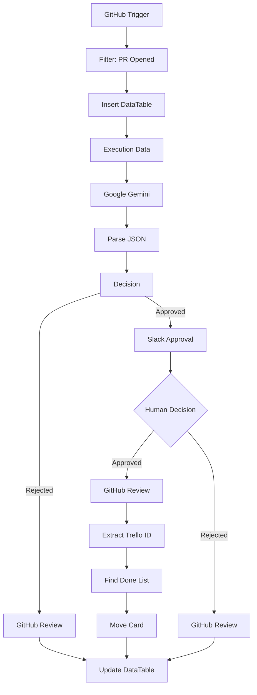

# 🤖 AI-Powered Pull Request Review Automation
### Intelligent CI Workflow with n8n, Google Gemini, GitHub, Slack & Trello

> AI-assisted code review workflow that automates Pull Request validation, incorporates **Human-in-the-Loop** approval, and synchronizes project status across GitHub, Slack, Trello, and n8n DataTables.

---

## 📌 Overview

This project implements an AI-powered Continuous Integration (CI) workflow using **n8n**.

When a Pull Request is opened, the workflow automatically analyzes the submitted code using **Google Gemini**, validates it against predefined engineering best practices, and decides whether it should continue to human approval or be rejected immediately.

If AI approves the Pull Request, the workflow requests final approval from a technical reviewer through **Slack Interactive Messages**. Once approved, GitHub, Trello, and the internal audit log are updated automatically.

The objective is to reduce repetitive manual reviews while maintaining human oversight for critical development decisions.

---

# 🚀 Features

- ✅ GitHub Pull Request Trigger
- ✅ AI-powered code review with Google Gemini
- ✅ Structured JSON output parsing
- ✅ Human-in-the-loop approval via Slack
- ✅ Automatic GitHub Review creation
- ✅ Gmail notifications
- ✅ Trello synchronization
- ✅ Internal audit logging with n8n DataTables
- ✅ Fully automated workflow orchestration

---

# 🛑 Problem

Code reviews frequently become a bottleneck during software development.

Engineering teams spend significant time reviewing repetitive coding standards while constantly switching between GitHub, Slack, Trello, and project management tools.

This context switching slows development and makes project tracking harder.

---

# 💡 Solution

This workflow automates the first stage of Pull Request validation.

Whenever a developer opens a Pull Request:

1. GitHub triggers the workflow.
2. The PR metadata is stored in n8n DataTables.
3. Source code is analyzed by Google Gemini.
4. Gemini returns a structured JSON decision.
5. The workflow evaluates the response.
6. If rejected, GitHub receives an automatic review.
7. If approved, Slack requests confirmation from a human reviewer.
8. Once approved:
   - GitHub Review is submitted
   - Trello card moves to **Done**
   - DataTables are updated
   - Audit trail is completed

This approach combines AI automation with human decision-making, following enterprise Human-in-the-Loop patterns.

---

# 🏗️ High-Level Architecture

```text
                 GitHub Pull Request
                         │
                         ▼
                 GitHub Trigger (n8n)
                         │
                         ▼
                  Store Execution Log
                  (DataTables)
                         │
                         ▼
                 Google Gemini Review
                         │
                  JSON Decision
                         │
              ┌──────────┴──────────┐
              │                     │
              ▼                     ▼
        AI Reject             AI Approves
              │                     │
              ▼                     ▼
      GitHub Review          Slack Approval
                                    │
                           ┌────────┴────────┐
                           ▼                 ▼
                    Human Reject      Human Approves
                           │                 │
                           ▼                 ▼
                     GitHub Review    GitHub Approval
                                             │
                                             ▼
                                     Update Trello
                                             │
                                             ▼
                                    Update DataTables
```

---

# 🔄 Workflow Architecture (n8n)



---

# ⚙️ Technologies

| Category | Technologies |
|-----------|--------------|
| Workflow Automation | n8n |
| AI | Google Gemini |
| Source Control | GitHub |
| Collaboration | Slack |
| Project Management | Trello |
| Email | Gmail |
| Programming | JavaScript |
| Data Storage | n8n DataTables |

---

# 🔄 Workflow Logic

## Step 1

GitHub detects a newly opened Pull Request.

---

## Step 2

The execution is registered in DataTables.

---

## Step 3

Google Gemini evaluates the submitted code according to predefined software engineering guidelines.

---

## Step 4

Gemini returns a structured JSON response.

Example:

```json
{
  "approved": true,
  "score": 9,
  "feedback": "Well structured code."
}
```

---

## Step 5

If the code is rejected:

- GitHub receives an automatic review.
- Execution status is updated.

---

## Step 6

If approved:

- Gmail notification is sent.
- Slack requests human approval.

---

## Step 7

After human approval:

- GitHub Review is submitted.
- Trello card moves to **Done**.
- Audit log is updated.

---

# 📊 Workflow Outcome

The implemented workflow provides:

- Automated first-pass code review
- AI-assisted development process
- Human validation before merge
- Automated project synchronization
- Centralized execution logging
- Reduced manual coordination between tools

---

# 📷 Screenshots

## Workflow (n8n)

> *Insert screenshot here*

---

## Slack Approval

> *Insert screenshot here*

---

## GitHub Review

> *Insert screenshot here*

---

## Trello Update

> *Insert screenshot here*

---

# 📁 Repository Structure

```
.
├── README.md
├── workflow.json
├── docs
├── screenshots
│   ├── workflow.png
│   ├── slack.png
│   ├── github-review.png
│   └── trello.png
└── assets
```

---

# 🔮 Future Improvements

- Remove the testing node that forces AI approval.
- Improve Slack rejection workflow.
- Replace Trello ID extraction with Regex validation.
- Add try/catch handling for malformed AI responses.
- Implement retry logic for external APIs.
- Add monitoring and execution metrics.
- Store execution history in PostgreSQL.
- Generate review reports automatically.

---

# 💼 Skills Demonstrated

- AI Workflow Orchestration
- Human-in-the-Loop Systems
- GitHub Automation
- Continuous Integration (CI)
- LLM Integration
- Prompt Engineering
- API Integration
- Workflow Automation
- Event-Driven Architecture
- JavaScript
- Enterprise Process Automation

---

# 📜 License

MIT License

---

## 👤 Author

**Fausto Enrique Soto Euraque**

AI Engineer | Data Scientist | Automation Engineer

- LinkedIn: https://linkedin.com/in/fsotoeu
- GitHub: https://github.com/fsotoeu-cyber


# Agente Financiero CNBS

**Asistente analítico del sistema bancario hondureño** con indicadores oficiales de la Comisión Nacional de Bancos y Seguros (CNBS).

Motor híbrido basado en **Pandas** y **Groq (Llama 3.3)**: Pandas realiza los cálculos determinísticos y el modelo de lenguaje únicamente genera explicaciones en lenguaje natural, con validación anti-alucinación.

[](https://www.python.org/)
[](https://streamlit.io/)
[](https://pandas.pydata.org/)
[](https://groq.com/)
[](https://plotly.com/)
[](https://www.reportlab.com/)
[](LICENSE)

<!-- Captura principal del dashboard (coloca la imagen en docs/) -->


---

## Resultados del proyecto

| Métrica | Valor |
|---------|--------|
| Bancos analizados | **14** |
| Indicadores financieros | **17** |
| Registros históricos | **~7,046** |
| Periodos mensuales | **~26** (p. ej. 2024–2026) |
| Exportación PDF | Informes del asistente y de tendencias |
| Exportación PNG | Gráficos de series temporales |
| Exportación Excel / CSV | Vista filtrada del explorador de datos |
| Motor | Híbrido **Pandas + Groq (Llama 3.3)** |
| Trazabilidad | LangSmith (opcional) |

---

## Tecnologías

| Capa | Herramientas |
|------|----------------|
| Lenguaje | Python 3.10+ |
| Interfaz | Streamlit |
| Datos y cálculo | Pandas |
| Visualización | Plotly · Kaleido (PNG) |
| LLM | Groq · Llama 3.3 70B · LangChain |
| Informes | ReportLab (PDF) · OpenPyXL (Excel) |
| Observabilidad | LangSmith *(opcional)* |

---

## Características técnicas

- Arquitectura híbrida **Pandas + LLM** (cálculo y redacción desacoplados)
- Cálculo **determinístico** de rankings, ratios y scores
- **Validación anti-alucinación** (ganador, ranking y cifras)
- Score de equilibrio triple: `(ROE / Morosidad) × (Capital / 100)`
- Ranking ROE / morosidad
- Hallazgos automáticos en tendencias (solo Pandas)
- Consultas conversacionales (fecha, saludo, ayuda) sin consumir tokens
- Exportación **PDF**, **PNG**, **Excel** y **CSV**
- Trazas opcionales en LangSmith

---

## ¿Cómo evita alucinaciones?


El LLM **nunca calcula**.

1. Todo cálculo financiero (promedios, rankings, ratios, scores) se realiza con **Pandas** sobre el CSV de la CNBS.
2. El modelo **solo redacta** la explicación a partir de un contexto ya calculado.
3. Antes de mostrar la respuesta se valida:
   - banco ganador
   - orden del ranking
   - ratios y scores
   - cifras presentes en el DataFrame
4. Si hay discrepancia, la respuesta se **reintenta o se corrige** de forma automática.

```text
Pregunta
   │
   ▼
 Pandas  ── calcula todo (rankings, ratios, scores)
   │
   ▼
 DataFrame de resultado
   │
   ├── respuesta directa (tablas / rankings)
   │
   └── si hace falta explicar
           │
           ▼
        LLM (solo redacta)
           │
           ▼
        Validador (ganador · cifras)
           │
           ▼
        UI / PDF
```

Ese patrón es el diferenciador del proyecto frente a un chatbot que “estima” indicadores.

---

## Características

| Módulo | Descripción |
|--------|-------------|
| **💬 Asistente** | Consultas en lenguaje natural: ROA, ROE, morosidad, capital, spread, liquidez, rankings y comparaciones |
| **📈 Tendencias** | EDA interactivo: series temporales, KPIs y hallazgos automáticos generados solo con Pandas |
| **📋 Datos** | Explorador del dataset CNBS con export Excel/CSV de la vista filtrada |

### Capacidades analíticas

- Ranking **ROE / morosidad** y **score de equilibrio triple**  
  `Score = (ROE / Morosidad) × (Capital / 100)`
- Comparaciones multi-banco y multi-indicador
- Evolución temporal (p. ej. 2024 vs 2025)
- Panel de riesgo crediticio (mora, cobertura, cartera de tarjetas)
- Respuestas cortas a charla (fecha, saludo, ayuda) **sin** consumir tokens de Groq

---

## Ejemplo de conversación

**Usuario**

> ¿Qué banco tiene mejor relación rentabilidad-riesgo en 2025? Considera ROE y morosidad.

**Asistente**

> **FICENSA** presenta la mejor relación rentabilidad–riesgo en 2025  
> (Ratio ROE/Mora = **12.95**).
>
> | # | Banco | ROE % | Mora % | Ratio |
> |---|--------|-------|--------|-------|
> | 1 | FICENSA | 9.30 | 0.72 | **12.95** |
> | 2 | BANHCAFE | 12.50 | 0.98 | 12.69 |
> | 3 | BANPAIS | 13.78 | 1.27 | 10.89 |
>
> Motor: **Pandas** · Confianza: Alta · ~0.02 s

**Usuario**

> Analiza el ranking de los 5 mejores bancos en 2025 según el score de equilibrio (ROE, morosidad y capital).

**Asistente**

> Ganador determinístico: **BANHCAFE** (Score triple ≈ **2.79**).  
> Tabla con ROE, mora, capital y score · justificación alineada con Pandas (+ LLM solo si se pide análisis detallado).

---

## Capturas de pantalla

| Módulo | Vista |
|--------|--------|
| Asistente |  |
| Tendencias |  |
| Datos |  |
| Informe PDF |  |

---

## Arquitectura del motor

```text
                 ┌──────────────────────┐
                 │   Streamlit (UI)     │
                 │ Asistente·Tendencias │
                 │        ·Datos        │
                 └──────────┬───────────┘
                            │
              ┌─────────────┴─────────────┐
              ▼                           ▼
     Consulta conversacional      Consulta financiera
     (sin Pandas / sin LLM)               │
                                          ▼
                               Clasificador de intención
                               planificar / es_consulta_*
                                          │
                    ┌─────────────────────┼─────────────────────┐
                    ▼                     ▼                     ▼
              Ranking               Comparar              Serie / promedio
           ROE-Mora / Triple      multi-indicador           temporal
                    │                     │                     │
                    └─────────────────────┴─────────────────────┘
                                          │
                                          ▼
                                   ┌─────────────┐
                                   │   Pandas    │
                                   │  (cálculo)  │
                                   └──────┬──────┘
                                          │
                           ┌──────────────┴──────────────┐
                           ▼                             ▼
                    Respuesta directa              ¿Necesita LLM?
                    (tablas / rankings)           Sí            No
                                                   │
                                                   ▼
                                            Groq Llama 3.3
                                            (solo redacción)
                                                   │
                                                   ▼
                                              Validador
                                           ganador · cifras
                                                   │
                                                   ▼
                                          UI + PDF / PNG / Excel
```

**Stack:** Streamlit · Pandas · Plotly · Groq (Llama 3.3 70B) · ReportLab · LangSmith (opcional)

---

## Estructura del repositorio

```text
agente-financiero-cnbs/
├── app.py                              # UI + motor híbrido
├── pdf_renderer.py                     # Informes PDF
├── indicadores_financieros_CNBS.csv    # Dataset CNBS
├── requirements.txt
├── README.md
├── LICENSE                             # MIT
├── docs/                               # Capturas (dashboard, tendencias, PDF…)
│   ├── dashboard.png
│   ├── tendencias.png
│   ├── datos.png
│   └── informe_pdf.png
└── .streamlit/
    └── secrets.toml                    # No versionar (solo en Cloud / local)
```

---

## Instalación local

```bash
git clone https://github.com/<tu-usuario>/agente-financiero-cnbs.git
cd agente-financiero-cnbs

python -m venv .venv
source .venv/bin/activate          # Windows: .venv\Scripts\activate

pip install -r requirements.txt
streamlit run app.py
```

### API Key

**Streamlit Secrets (recomendado)**

```toml
# .streamlit/secrets.toml  — no subir a Git público
GROQ_API_KEY = "gsk_..."

# Opcional — LangSmith
LANGCHAIN_API_KEY = "lsv2_..."
LANGCHAIN_TRACING_V2 = "true"
LANGCHAIN_PROJECT = "Agente-CNBS"
```

También puedes pegar la clave en el **sidebar** de la app o usar la variable de entorno `GROQ_API_KEY`.

---

## Deploy en Streamlit Community Cloud

### Archivos a subir al repo

| Archivo | Obligatorio |
|---------|-------------|
| `app.py` | Sí |
| `pdf_renderer.py` | Sí |
| `indicadores_financieros_CNBS.csv` | Sí |
| `requirements.txt` | Sí |
| `README.md` | Recomendado |
| `docs/*.png` | Recomendado (README) |

**No subas** `.streamlit/secrets.toml` ni `.env` con claves reales.

### Pasos

1. Publica el repo en GitHub.
2. Entra a [share.streamlit.io](https://share.streamlit.io) y conecta el repositorio.
3. **Main file path:** `app.py`
4. **Settings → Secrets:**

```toml
GROQ_API_KEY = "gsk_tu_clave"
```

5. Deploy → URL tipo `https://<app-name>.streamlit.app`

### `requirements.txt`

```text
streamlit>=1.28.0
pandas>=2.0.0
plotly>=5.18.0
langchain-groq>=0.2.0
langchain-core>=0.3.0
reportlab>=4.0.0
kaleido>=0.2.1
openpyxl>=3.1.0
langsmith>=0.1.0
```

---

## Más ejemplos de consulta

```text
Compara AZTECA, BAC CREDOMATIC y FICOHSA en 2025 (ROA, ROE, mora, capital).
¿Qué banco presenta el perfil más equilibrado?

Analiza el riesgo crediticio del sistema en 2025 (mora, cobertura y tarjetas).

Compara la evolución del ROA y ROE del sistema entre 2024 y 2025.

¿Qué día es hoy?          → respuesta corta, sin Pandas ni LLM
```

---


## Rendimiento

| Métrica | Valor |
|---------|--------|
| Consultas determinísticas (solo Pandas) | ~0.02 s |
| Consultas con LLM (redacción) | ~1–2 s |
| Dataset | ~7,046 registros |
| Bancos | 14 |
| Indicadores | 17 |
| Periodos mensuales | ~26 |

---

## Limitaciones

- Analiza **únicamente** los indicadores presentes en el dataset oficial de la CNBS.
- **No** realiza predicciones financieras ni proyecciones a futuro.
- **No** sustituye análisis ni dictámenes regulatorios oficiales.
- Si el dataset no contiene información suficiente para una consulta, el sistema informa que **no hay datos disponibles** (no inventa cifras).
- El dataset no incluye montos absolutos de activos o cartera; solo ratios y porcentajes.

---

## Aprendizajes

Durante el desarrollo del proyecto se aplicaron y consolidaron:

- Arquitecturas híbridas **Pandas + LLM**
- Ingeniería de prompts y gobernanza del modelo
- Validación **anti-alucinación** en datos financieros
- Detección de intención y enrutamiento de consultas
- Streamlit (UI, sesión, exports)
- Pandas (cálculo determinístico y rankings)
- Plotly y Kaleido (visualización y PNG)
- ReportLab (informes PDF)
- LangChain + Groq (Llama 3.3)
- Observabilidad con LangSmith
- Procesamiento ligero de lenguaje natural sobre consultas financieras

---

## Dataset

Indicadores publicados por la **CNBS (Honduras)**: ratios y porcentajes por institución y fecha de reporte.

> El dataset no incluye montos absolutos de activos o cartera; solo indicadores relativos (%).

---

## Licencia

Distribuido bajo **MIT License**.  
Proyecto desarrollado con fines educativos, demostración técnica y portafolio profesional. Los datos pertenecen a la **Comisión Nacional de Bancos y Seguros (CNBS)**; este proyecto no sustituye dictámenes regulatorios oficiales.

```text
MIT License — ver archivo LICENSE
```

---

## Créditos

- **Datos:** Comisión Nacional de Bancos y Seguros (CNBS), Honduras
- **Stack:** Streamlit · Pandas · Plotly · Groq · ReportLab · LangSmith
- **Versión:** Agente Financiero CNBS v6.3 · Euraque Analytics
